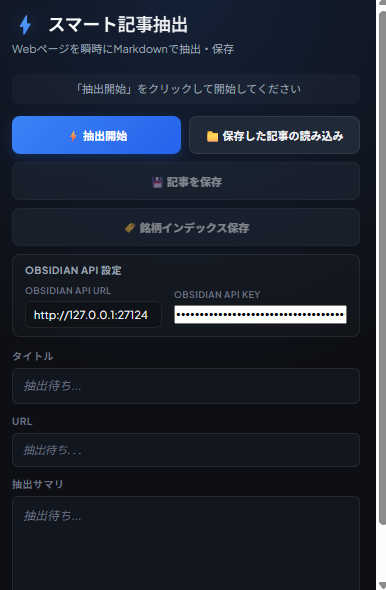
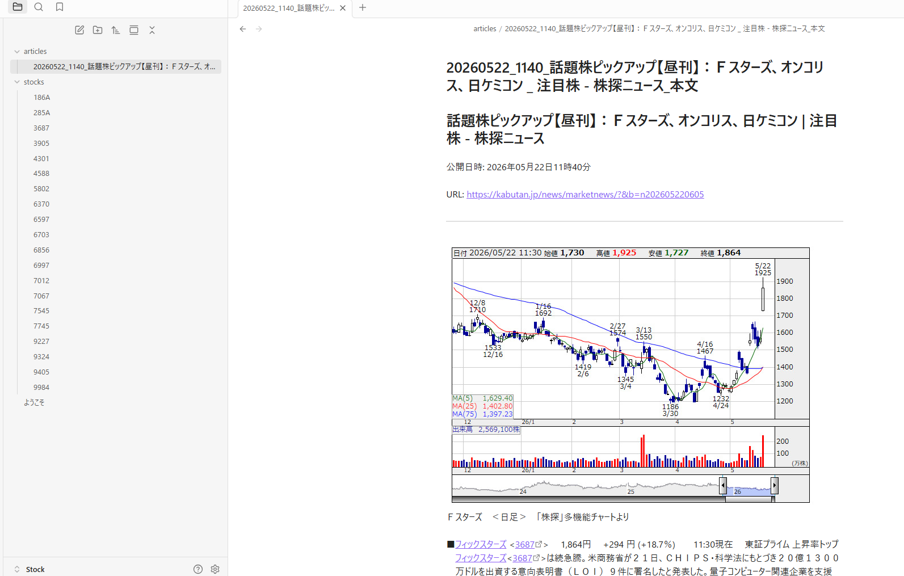

# Smart Page Extractor

投資ニュースやWeb記事を自動で構造化し、Obsidianの知識ベースへ変換するためのChrome拡張です。

記事抽出・銘柄検出・ノート生成を自動化し、「読む投資情報」を「再利用できる投資データ」へ変換します。

---

## 主な機能

- Web記事をMarkdown形式で保存
- 銘柄コードを自動抽出
- 銘柄別インデックスノートを生成
- Obsidian Vaultへ直接ノート保存

---

## 対応サイト

- 株探（Kabutan）の注目ニュース系ページ
  https://kabutan.jp/news/marketnews/?category=9

---

## ダウンロード

GitHub Releases から最新版をダウンロードしてください。

最新版はこちら：
https://github.com/stockflowlab-ops/invest-note-extension/releases/download/v1.0.0/SmartPageExtractor_v1.0.0.zip

---

# Obsidianの準備

本ツールを利用する前に、ObsidianのインストールとREST APIプラグインの設定を行ってください。

---

## 1. Obsidianをインストール

Obsidian公式サイト：  
https://obsidian.md/

1. 公式サイトからObsidianをダウンロードしてインストール
2. Vault（保管庫）を新規作成して開く

---

## 2. Community Plugins（コミュニティプラグイン）を有効化

1. Obsidian左下の「設定（歯車アイコン）」を開く
2. 「コミュニティプラグイン」を開く
3. 「コミュニティプラグインを有効化」を押す（無効化されている場合）

---

## 3. Local REST API & MCP Server をインストール

1. 「コミュニティプラグイン」画面で「閲覧」を押す
2. 検索欄で `REST` と入力
3. `Local REST API & MCP Server` を選択
4. 「インストール」を押す
5. 「有効化」を押す

---

## 4. HTTPS証明書をインストール

1. Obsidian設定 → `Local REST API & MCP Server` を開く
2. `this certificate` リンクをクリックして証明書ファイルをダウンロード  
   （警告ページが表示される場合があります。その場合は「詳細設定」を押し、「（サイト名）にアクセスする（安全ではありません）」をクリックしてください）
3. ダウンロードした `.crt` ファイルをダブルクリック
4. 「証明書のインストール」を押す
5. 「現在のユーザー」を選択して「次へ」
6. 「証明書をすべて次のストアに配置する」を選択
7. 「参照」 → 「信頼されたルート証明機関」を選択
8. 「次へ」 → 「完了」を押す
9. セキュリティ警告が表示された場合は「はい」を選択
10. 「インポートは正常に完了しました」が表示されれば完了

---

## 5. APIキーを確認

1. Obsidian設定 → 「コミュニティプラグイン」
2. `Local REST API & MCP Server` を開く
3. 表示されるAPIキーをコピー

このAPIキーをChrome拡張側へ設定してください。

---

# Chrome拡張のインストール

1. Chromeで `chrome://extensions/` を開く
2. 右上の「デベロッパーモード」をONにする
3. 「パッケージ化されていない拡張機能を読み込む」を選択
4. ダウンロードしたZIPファイルを展開し、展開後のフォルダを指定する
5. Chrome拡張の設定画面でObsidianのAPIキーを入力

---

## 記事の保存方法

1. 株探の注目ニュースページを開く
2. Chrome拡張を開く
3. 「記事を保存」を押す
4. MarkdownファイルがObsidian Vault内へ保存される
5. 「銘柄別インデックス」を押すと、銘柄別インデックスノートが自動生成される

---

## こんな方におすすめ

- 投資ニュースをあとから見返したい
- Obsidianで投資メモを管理したい
- 銘柄ごとにニュースを整理したい
- AI分析用のMarkdownデータを蓄積したい

---

## 注意事項

- 本ツールは個人開発ツールです。
- Chrome・Obsidian・対象サイトの仕様変更により、一部機能が動作しなくなる場合があります。
- 株探など外部サイトの仕様変更については保証対象外となります。
- 本ツールの利用によって発生した損害について、作者は責任を負いません。
- 自己責任でご利用ください。

---

## アップデート・不具合対応について

- 致命的な不具合については、可能な範囲で修正対応します。
- 修正版はGitHub ReleasesのZIP差し替えで提供します。
- 軽微な改善や機能追加は、今後のアップデートで対応する場合があります。
- すべての要望・環境への対応を保証するものではありません。

---

Smart Page Extractor は、
「あとで読む投資情報」を「蓄積・検索・再利用できる知識資産」へ変換することを目的としたツールです。
